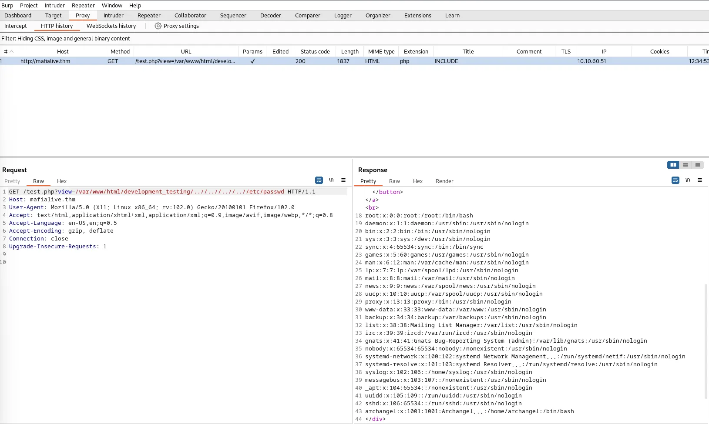

# Pentesting a la pagina
##
Exploracion web 

nmap

vemos la pagina

vemos que puede existir un nombre para usarlo como dominio 

lo ponemos en hostname

Si escaneamos los directorios que tiene este servidor encontramos robots.txt y test.php

en test.php hay una probabilidad

Local File Inclusion: 

ya que muestra las paginas asì 
http://mafialive.thm/test.php?view=/var/www/html/development_testing/mrrobot.php

con burpsuite podemos explotar esta vulnerabilidad

vemos que el servidor tiene los usuarios root y archangel

viendo los logs de apache podemos ver que tiene otra vulnerabildiad
( Log Poisoning )
ponemos abrir una terminal usando el user-agent para ingresar a el servidor

ya dentro del servidor 

podemos una version de linux la cual no es actualizada 4.15.0-123-generic 
la cual tiene vulnerabilidades como
[+] [CVE-2022-2586] nft_object UAF
[+] [CVE-2019-15666] XFRM_UAF
[+] [CVE-2017-0358] ntfs-3g-modprobe

que afecta en esta version de ubuntu 

una version de sudo con varias vulnerabilidades
[+] [CVE-2021-3156] sudo Baron Samedit 2

desde el sistema esas fueron las unicas vulnerabilidades que se hallaron.

